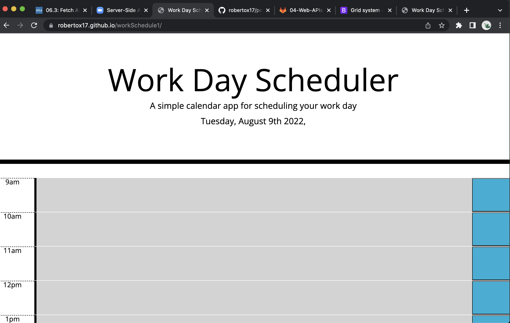

# workSchedule1

## Description

My motivation for this project was to get the application to actually work and serve its purpose. I built this project so the user can store their daily task for work meanwhile keeping it nice and organized. This application lets the user plan their work day and keep it organised, the application lets you know the current hour according to the color past is gray , present is red , and future is green solves the problem of oraginization and also helps keep track of your task. I definetly sharpened my use of jquery and learned how to make a for loop with Jquery. I also learned that you can acess the css page from the script page and use it so you can make conditional statements.

## Usage

Provide instructions and examples for use. Include screenshots as needed.

https://robertox17.github.io/workSchedule1/

   
 

